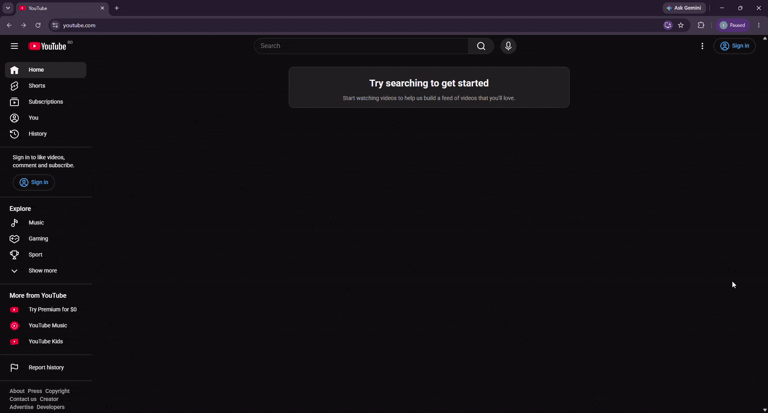
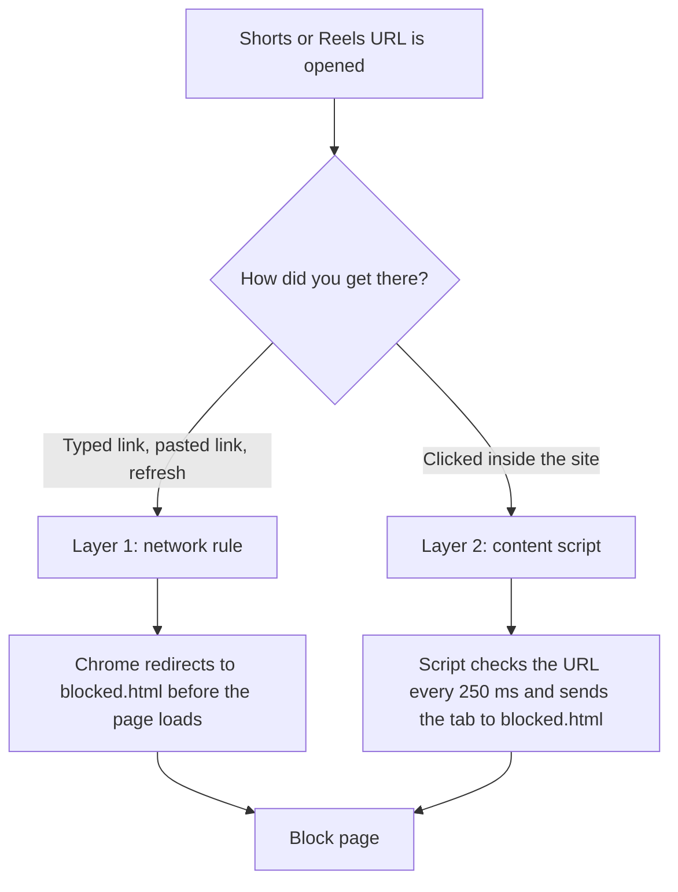
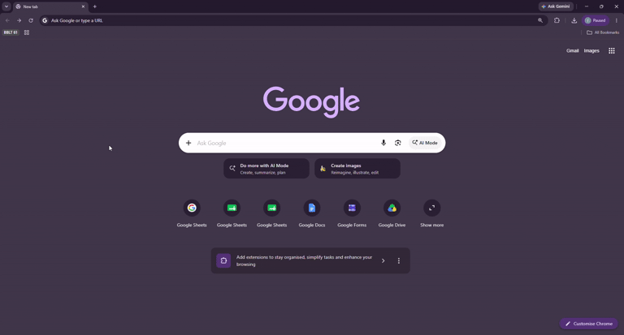

<h1 align="center">ShortsBlock</h1>

<p align="center">
  A Chrome and Edge extension that hard-blocks YouTube Shorts and Instagram Reels.
</p>

<p align="center">
  
  
  
  
</p>

<p align="center">
  
</p>

## Contents

- [Overview](#overview)
- [How it works](#how-it-works)
- [Project structure](#project-structure)
- [Install](#install)
- [Design decisions](#design-decisions)
- [Testing by breaking it](#testing-by-breaking-it)
- [Known limits](#known-limits)
- [Future work](#future-work)

## Overview

I built this to stop me from getting pulled into a short-form video. When a Shorts or Reels page is opened, it is replaced by a block page that says "You Tried Opening A Short Form Content". There is no skip button and no timer.

- Blocks YouTube Shorts (URLs with `/shorts/`) and Instagram Reels (URLs with `/reels/`).
- Works for typed links, refresh, and clicks inside the site.
- Built in 3 days with plain JavaScript and Manifest V3. No framework, no build step.

## How it works

YouTube and Instagram load pages in two different ways, so the extension has two layers.

| Layer | File | Catches | Flash of real content? |
| --- | --- | --- | --- |
| 1. Network rule | `dnr_rules.json` | Typed links, pasted links, refresh | No |
| 2. Content script | `content.js` | Clicks inside the site (the page does not reload) | Short, up to about 250 ms |



**Layer 1: network rule.** Chrome checks each new page request against `dnr_rules.json` using the `declarativeNetRequest` API. If the URL matches, Chrome redirects to `blocked.html` before the real page loads.

<p align="center">
  
</p>

 One rule looks like this:

```json
{
  "id": 1,
  "priority": 1,
  "action": {
    "type": "redirect",
    "redirect": { "extensionPath": "/blocked.html" }
  },
  "condition": {
    "urlFilter": "*://*.youtube.com/*shorts/*",
    "resourceTypes": ["main_frame"]
  }
}
```

**Layer 2: content script.** YouTube and Instagram are single-page apps. Clicking a Short does not reload the page, so no new request is made and Layer 1 never sees it. `content.js` is already running inside the page, so it checks the URL every 250 ms. When the URL has `/shorts/` or `/reels/`, it sends the tab to `blocked.html` with `window.location.replace`.

**Why the manifest lists each site three times.** Each list gives a different permission.

| Manifest field | What it allows |
| --- | --- |
| `host_permissions` | The network rules can act on these sites |
| `content_scripts.matches` | `content.js` can run on these sites |
| `web_accessible_resources.matches` | These sites can be redirected to `blocked.html` |

## Project structure

```
ShortsBlockExtension/
├── manifest.json      # Name, permissions, and which files run where
├── content.js         # Layer 2: watches the URL inside the page
├── dnr_rules.json     # Layer 1: redirect rules for direct navigation
├── blocked.html       # The one block page both layers send you to
├── _metadata/         # Made by Chrome. Ignored by Git
└── assets/            # Demo gifs for ReadMe docs
```

## Install

1. Clone this repository.
2. Open `chrome://extensions` (or `edge://extensions` in Edge).
3. Turn on Developer mode.
4. Click **Load unpacked** and pick the project folder.
5. After you change any file, click the reload icon on the extension card.

## Design decisions

| Decision | Why | Cost |
| --- | --- | --- |
| Chrome and Edge only, Manifest V3 | Both use the same Chromium extension system, so one codebase covers both. | No Firefox or Safari. |
| Hard block, no timer or warning | The goal is to stop, and a timer or warning still lets me in. | No way to open a Short, even on purpose. |
| Plain JavaScript, no framework or build step | Small project, and I was new to JavaScript. Fewer moving parts. | No modern tooling. Fine at this size. |
| Two layers instead of one | Each layer covers what the other cannot. `content.js` alone blocks correctly, with a flash. The network rule removes that flash on direct navigation. It is also a backup if `content.js` fails to run (not tested). | Two places to keep in sync. |
| `redirect` instead of `block` in the rules | `block` shows Chrome's own error page. `redirect` shows my page. | Needs `host_permissions` and `web_accessible_resources`. |
| `content.js` redirects to `blocked.html` | One block page for both layers. The first version wiped the page with `innerHTML` and called `window.stop()`, and it kept its own copy of the block page HTML. | The tab URL becomes the extension page. |
| Polling every 250 ms | These sites do not reload, so the check has to repeat. Polling is simple. 250 ms uses less CPU than 100 ms. | Content can show for a moment before the block. |
| URL patterns end with a slash (`shorts/`, `reels/`) | A loose pattern like `*shorts*` would match unrelated URLs. | A URL typed without the trailing slash can slip past the first request. |
| Instagram feed reels and TikTok left out | Feed reels have no separate URL, so URL matching cannot see them. TikTok was dropped for time. | Both are documented as limits. |

## Testing by breaking it

I broke parts of the extension on purpose to learn why each part is there.

| What I changed | What happened | What I learned |
| --- | --- | --- |
| Removed `instagram.com` from `host_permissions` only | Reels were still blocked, with a flash | Each grant is separate. Each layer can block on its own. |
| Changed `run_at` from `document_start` to `document_end`, then clicked inside the site | No difference | `run_at` only affects the first injection. Later clicks happen inside the polling loop. |
| Renamed `dnr_rules.json` without updating the manifest | The extension would not load | Paths in the manifest must match the real file names. |
| Considered a loose pattern (`*shorts*`) | Not shipped. Reasoned through only | It would block unrelated URLs. The strict pattern is the better trade. |
| *First version:* removed `window.stop()` | The block message showed, but Shorts audio kept playing | The 250 ms gap lets media start before the check runs. |
| *First version:* used `history.back()` instead of `reload()` after a block | The address bar changed but the page stayed frozen | After `window.stop()` the page cannot redraw. |

The last two rows are from the first version of `content.js`, before it redirected to `blocked.html`.

## Known limits

- Reel-style videos in the Instagram home feed are not blocked. They have no separate URL.
- Clicking into Shorts or Reels from inside the site can show a short flash before the block.
- It does not work in Incognito for now (work in progress).
- TikTok is not supported.
- There is no on/off switch. Disable the extension in the browser instead.

## Future work

- Detect page changes with real events instead of polling.
- Detect feed reels by scanning the page.
- Add TikTok and other platforms.
- Add a popup with an on/off switch and a block counter.
